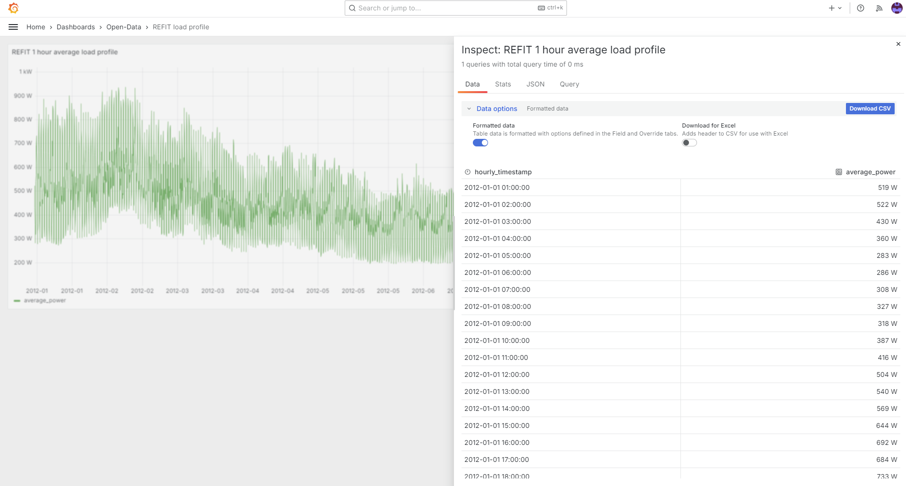

# Exporting Data from the Open Energy Data Server

There are 4 different methods to utilize the data of the open-energy-data-server:

1. **SQL** Connection
2. **PostgREST** for HTTP readonly access through REST-like API
3. **Grafana** export from a selected graph and view
4. **PgAdmin4** Web-Interface for SQL in a browser

The following examples shows retrieval of the same dataset (average data from london smartmeter measurements) for the different methods.

## SQL using Python

```python
import pandas as pd
from sqlalchemy import create_engine

engine = create_engine('postgresql://timescale.nowum.fh-aachen.de:5432/opendata?search_path=londondatastore')
query = "SELECT ""DateTime"" AS hourly_timestamp,  AVG(""power"") AS average_power FROM consumption WHERE DateTime >= '2012-01-01' AND DateTime <= '2013-01-01' LIMIT 10"

with engine.connect() as conn:
    df = pd.read_sql(query, conn, parse_dates="DateTime", index_col="DateTime")
df = df.resample("1h").mean()
df.to_csv("londondatastore_pgrst.csv")
```

## HTTP using Python requests

```python
import requests
import pandas as pd

url = "https://monitor.nowum.fh-aachen.de/oeds/consumption"
headers = {
    "Accept": "application/json",
    "Accept-Profile": "londondatastore"
}
params = {
    "limit": 10,
    "DateTime": "gte.'2012-01-01'",
    "DateTime": "lte.'2013-01-01'",
    "select": "DateTime,power.sum()",
}

response = requests.get(url, headers=headers, params=params)
df = pd.DataFrame.from_records(response.json(), index="DateTime")
df.index = pd.to_datetime(df.index)
df = df.resample("1h").mean()
df.to_csv("londondatastore_pgrst.csv")
```

## Grafana

Using the Graph from this dashboard: https://monitor.nowum.fh-aachen.de/d/edn5t9gi0wyrke/refit-load-profile?orgId=1

One can inspect to see the data (or the query) of the graph easily as shown below:




## PgAdmin4

PgAdmin is quite powerful and therefore not publically available, though you can use your instance on the open-energy-data-server for all of your institute for quick analysis.
It also lets you explain a query or create Indexes or Alter tables interactively.
pgAdmin can also draw ER-Diagrams from a schema or table in your database

